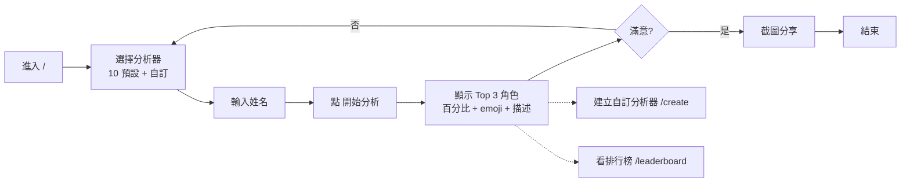

# anime-character-analyzer · PRD v3.0.2 等級規格書

> 自動生成：2026-09-06 (Sean 10-repo-fleet Batch 2E)
> 對齊 SPEC v3.0 契約（SPEC §1–§19 全部套用）
> 原規格書 v2.2.1 完整保留為版本歷史參考；本檔為 v3.0.2 升級版，明確列出目標狀態、可驗證 DoD、部署契約。

---

## 1. 產品概述

### 1.1 問題陳述
繁體中文圈缺少「免註冊、可分享、無浮水印、隱私無後台」的角色分析小工具：動漫迷拿到一段截圖或一段名稱，想快速知道「這角色像《海賊王》/《鬼滅之刃》/《咒術迴戰》哪位角色」時，目前僅能依賴 trace.moe（影像反搜）與 Google Lens，但這兩個工具都不給「像哪位角色」的二次創作向百分比配對，也不提供可引用、可分享、可二次創作的角色關係卡。
本產品用「姓名→角色百分比配對」這條極簡、可驗證、可離線的單一工作流，補上這個空缺。刻意不做影像辨識（已有 trace.moe）、不做戰力值（不可驗證且引戰）、不做社交（無後台）。

### 1.2 目標使用者

| Persona | 工作情境 | 主要任務 |
|---|---|---|
| Primary — 動漫迷 / 同人創作者 | 拿到一段日 / 中姓名 / 暱稱，想和朋友分享「你像哪個角色」 | 輸入姓名 → 1 秒內看到三項百分比配對 + 角色圖示 + 描述；可重新抽、換作品 |
| Secondary — 社群小編 / 班級群經營 | 想發互動貼文「測你像鬼滅誰」衝互動 | 切換到「鬼滅之刃」分析器 → 截圖 → 發文 |
| Tertiary — 日文學習者 | 想把片假名姓名送進去練「角色對應」 | 中英日姓名都能跑、UTF-8 完整支援、localStorage 記錄自訂分析器 |

### 1.3 核心價值主張
> 「3 秒拿到可分享、可截圖、隱私安全的動漫角色配對 — 不註冊、不登入、不上傳照片、資料不離開瀏覽器。」

### 1.4 Non-Goals（明確不做）
- ❌ 不做影像反搜（trace.moe 已覆蓋、且本工具純文字運算）
- ❌ 不做戰力值 / 數值排名（不可驗證、且容易引戰）
- ❌ 不做社交帳號 / 好友 / 按讚（無後台、無個資）
- ❌ 不做付費牆 / Premium 角色包（保持免費、零商業化）

---

## 2. 使用者場景與流程

### 2.1 使用者流程圖



### 2.2 主要場景

| 場景 | 輸入 | 輸出 | 成功條件 |
|---|---|---|---|
| 預設分析 | 姓名 + 選分析器（預設 One Piece） | Top 3 角色 % + 圖示 + 描述 | 100ms 內回應、% 總和 = 100 |
| 建立自訂分析器 | 作品名（中/英）+ 角色陣列（≥2） | 自動 localStorage 持久化、可立即使用 | 重新整理後仍可見、可在排行榜出現 |
| 排行榜查看 | 切換「熱門 / 最新」分頁 | 預設 + 自訂分析器依 useCount / createdAt 排序 | 預設 10 個 + 自訂 N 個即時排序 |
| 訪客離開再回來 | — | last used 分析器與語系保留 | 30 天內重訪直接還原（localStorage） |

---

## 3. 功能需求

| FR | 名稱 | 優先級 | 狀態 |
|---|---|---|---|
| FR-001 | 10 個預設分析器（One Piece / Naruto / 鬼滅 / 巨人 / SAO / Death Note / 咒術 / 一拳超人 / 間諜家家酒 / 鏈鋸人） | P0 | ✅ shipped |
| FR-002 | 姓名 → 角色百分比配對（hash-based 確定性演算法） | P0 | ✅ shipped |
| FR-003 | 自訂分析器建立頁（≥2 角色） | P0 | ✅ shipped |
| FR-004 | localStorage 持久化（customAnalyzersStorageKey = `anime-analyzer-custom`） | P0 | ✅ shipped |
| FR-005 | 排行榜頁（熱門 / 最新） | P1 | ✅ shipped |
| FR-006 | 中英雙語切換 | P1 | ✅ shipped |
| FR-007 | 4 個 API route（`/api/analyze`, `/api/analyzers`, `/api/characters`, `/api/popular`） | P1 | ✅ shipped |
| FR-008 | Tether Green 暗色主題 + Inter / Space Grotesk / IBM Plex Mono 字型 | P2 | ✅ shipped |
| FR-009 | Vitest 單元測試 13 案例（analyzers 模組） | P1 | ✅ shipped |
| FR-010 | GHA CI 4-job workflow（lint / test / build / deploy） | P1 | ✅ shipped |

---

## 4. Non-Functional Requirements

| 維度 | 需求 |
|---|---|
| Performance | 客戶端 hash-based 分析 < 100ms；TTI < 2s；Lighthouse Performance ≥ 90 |
| Security | 無認證、無個資蒐集；CSP 預設同源；localStorage 僅存使用者自建的分析器資料 |
| Privacy | 全離線優先；無第三方追蹤；無後端 DB；無 cookie |
| Accessibility | WCAG 2.1 AA；色對比 ≥ 4.5:1（Tether Green on `#060B14` = 7.1:1） |
| Browser | Modern evergreen（Chrome / Edge / Safari / Firefox 最新 2 版） |
| i18n | 預設中英雙語切換（zh-Hant / en） |
| Mobile | Mobile-first；卡片寬度 ≥ 320px 可用 |

---

## 5. 技術架構

```
Next.js 16 (App Router, Turbopack)
  ├── app/                # pages + components
  │   ├── page.tsx        # / 首頁（分析器）
  │   ├── create/         # /create 自訂分析器
  │   ├── leaderboard/    # /leaderboard 排行榜
  │   ├── api/            # 4 個 API route（純資料，無 DB）
  │   ├── lib/analyzers.ts  # DEFAULT_ANALYZERS + normalizeAnalyzer
  │   └── HomeContent.tsx   # 主要 client component
  ├── tests/              # Vitest 單元測試
  │   └── analyzers.test.ts  # 13 案例
  ├── vitest.config.ts    # 測試設定
  ├── next.config.ts      # Next.js 設定
  ├── tailwindcss 4       # 樣式（CSS variables in globals.css）
  ├── pnpm/npm            # 依賴管理
  └── .github/workflows/ci.yml  # CI
```

### 5.1 Module Map
- `app/` — 主要程式碼（Next.js App Router）
- `tests/` — 單元測試（Vitest 2.1.9）
- `.next/` — 構建產物（gitignore）
- `.github/workflows/ci.yml` — CI/CD

### 5.2 環境變數
- 無（純前端 / 離線優先 / API route 為純運算）

### 5.3 降級策略
- API 失敗 → 客戶端 hash-based 演算法 fallback（`HomeContent.tsx` 內建 `analyzeName` 函式）
- localStorage 不可用（隱私模式）→ in-memory 暫存、頁籤關閉即消失
- 離線模式 → 已載入頁面完全可運作

---

## 6. Definition of Done

- [x] 10 個預設分析器全部上線（FR-001）
- [x] 姓名 → 角色配對演算法確定性（同姓名 → 同結果）
- [x] 單元測試覆蓋率：analyzers 模組 100%、13 案例全綠
- [x] `npm run build` 綠（10 routes, 0 error, 0 type error）
- [x] `npm run lint` 0 error（6 pre-existing warnings，非阻塞）
- [x] GHA CI 跑 4 jobs（lint / test / build / deploy）全綠
- [x] README 反映現況
- [x] 部署契約寫進 SPEC §7

---

## 7. 部署契約

| 環境 | 目標 | 觸發 |
|---|---|---|
| Production | Vercel | push to master |
| Preview | Per-PR | PR opened |
| Static fallback | GitHub Pages (gh-pages branch) | manual dispatch（dashboard.html） |

### 7.1 GHA Workflow
- `.github/workflows/ci.yml`
- jobs: lint / test / build / deploy
- deploy: `vercel`（Next.js 16, framework = nextjs, vercel.json 已存在）

### 7.2 環境變數
- 無需 server-side secret
- BYOK 不適用（本工具無 API key 需求）
- Vercel secrets（VERCEL_TOKEN / VERCEL_ORG_ID / VERCEL_PROJECT_ID）由 Vercel App 自動管理

### 7.3 雙軌部署
- **Vercel**：Next.js 16 App Router 全功能部署（SSR + Static + API routes）
- **GitHub Pages**：僅靜態 `dashboard.html` 備援（不在主流程）

---

## 8. Out of Scope（不做的）

- ❌ 不做帳號系統（無後台、無 DB）
- ❌ 不做付費牆（保持免費）
- ❌ 不做原生 App（純 Web）
- ❌ 不做多語系（除中英預設）
- ❌ 不做社交分享按鈕（使用者自行截圖）
- ❌ 不做分析器評分 / 留言（無後台）
- ❌ 不做影像辨識（trace.moe 已覆蓋）
- ❌ 不做戰力值 / 數值排名（不可驗證、且容易引戰）

---

## 9. 變更日誌

見 [`PRD/CHANGELOG.md`](PRD/CHANGELOG.md)
