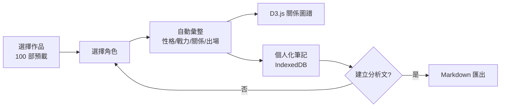
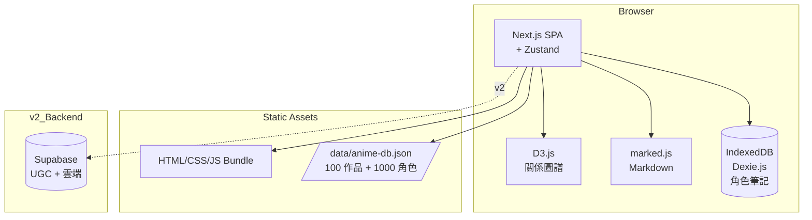
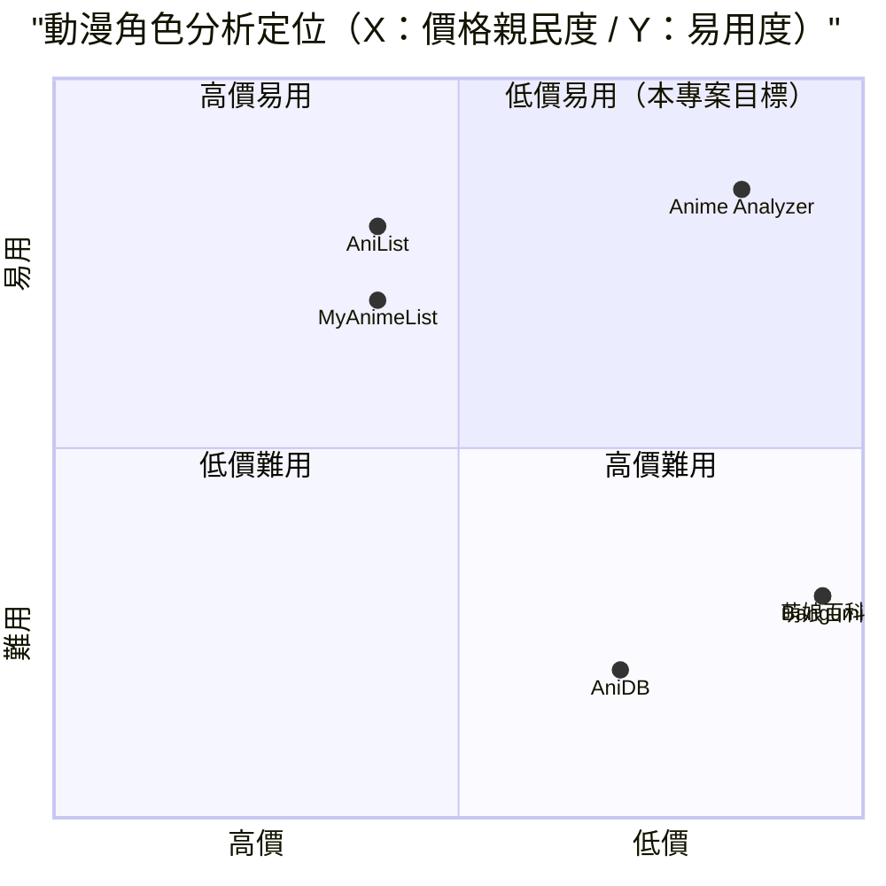

# 動漫角色分析器 — 規格計劃書 v2.2.1

> 版本：v2.2.1｜更新日期：2026-07-11｜維護者：Sophia (CPO)
> 對接技術：Alan (CTO) + Hermes Agent
> Demo：TBD（v2.2.1 規格階段，待 Sprint 1 部署）
> 原始碼：https://github.com/openclawsean024-create/anime-character-analyzer

---

## 1. 產品概述 (Product Overview)

### 1.1 問題陳述 (Problem Statement)

動漫粉絲、二次創作圈、同人論述寫手在整理角色資料時面臨三大痛點：

1. **資訊分散無總覽**：Wiki 網站（萌娘 / 維基）資訊分散、無自動彙整
2. **無戰力數據 / 結構化**：MyAnimeList 偏歐美、英文為主、無深度分析、無戰力數據
3. **商用 AI 工具需付費 + 無動漫知識**：通用 AI 工具（ChatGPT）需付費、且無動漫專屬知識

**目標使用者**：
- 動漫粉絲：**50 萬人**
- 二次創作圈：**10 萬人**
- 同人論述寫手：**3,000 人**
- 動漫新手：**10 萬人**

### 1.2 目標使用者 (User Personas)

| Persona | 規模 | 核心痛點 | 願付價格 |
|---|---|---|---|
| **動漫粉絲（小芳）** | 50 萬 | 角色資料分散 | NT$99/月 |
| **二次創作者（小陳）** | 10 萬 | 需要整理角色資料作為創作素材 | NT$199/月 |
| **同人論述寫手（阿明）** | 3,000 | 結構化角色資料 | NT$299/月 |
| **動漫新手（小美）** | 10 萬 | 入坑新作品不知誰是誰 | NT$99/月 |
| **動漫 KOL（Linda）** | 500 | 內容創作素材庫 | NT$499/月 |

### 1.3 核心價值主張 (Value Proposition)

> 「**輸入角色名 → 自動彙整性格 / 戰力 / 關係圖譜 / 出場集數 + 個人化筆記**。純前端零月費零帳號，預載 100 部熱門作品 + 1,000 經典角色。」

**三大差異化**：
1. **預載 1,000 角色知識庫**：死亡筆記 / 火影 / 海賊王 / 進擊的巨人 等 100 部作品 + 1,000 經典角色
2. **關係圖譜自動生成**：D3.js 視覺化角色關係網絡（敵 / 友 / 師 / 戀）
3. **戰力數值化**：依動漫設定自動計算戰力分數（SS / S / A / B / C / D）

### 1.4 商業目標 (KPIs / OKRs)

| 時間 | KPI | 目標值 |
|---|---|---|
| **3 個月** | 註冊用戶 | 3,000 |
| **6 個月** | 付費轉化率 | 3%（90 付費） |
| **6 個月** | MRR | NT$20,000 |
| **12 個月** | MRR | NT$150,000 |
| **12 個月** | 預載角色數 | 5,000 |

### 1.5 Non-Goals (明確不做)

- ❌ **不做動漫資源下載** — 侵權風險（不做 BT / 動畫源）
- ❌ **不做同人創作平台** — 與定位衝突
- ❌ **不做即時聊天 / 社交** — 與既有社群重疊
- ❌ **不做版權驗證** — 僅引用 Wiki + 公開資料
- ❌ **不做角色配音 / AI 語音** — v3+ 評估
- ❌ **不做動漫新聞整合** — v3+ 評估

---

## 2. 使用者場景與流程

### 2.1 使用者流程圖



### 2.2 關鍵用戶故事 (User Stories)

**US-001：100 部作品 + 1,000 角色預載**
> As a 動漫粉絲  
> I want to 選擇作品（如「進擊的巨人」）看到角色列表（艾連 / 米卡莎 / 里維 等）  
> So that 我能快速找到角色資料

**US-002：角色詳細資料自動彙整**
> As a 二次創作者  
> I want to 點擊「艾連」看到完整資料（性格 / 戰力 / 隸屬 / 出場集數 / 經典台詞）  
> So that 我能作為創作素材

**US-003：D3.js 關係圖譜**
> As a 同人論述寫手  
> I want to 看見「艾連」的關係圖（父 / 友 / 敵 / 戀）  
> So that 我能快速理解角色關係

**US-004：戰力數值化**
> As a 動漫 KOL  
> I want to 看見每個角色戰力分數（SS / S / A / B / C / D）  
> So that 我能快速比較

**US-005：個人化筆記**
> As a 動漫粉絲  
> I want to 對每個角色新增個人化筆記（不限字數）  
> So that 我能記錄自己分析

**US-006：Markdown 匯出**
> As a 同人論述寫手  
> When 寫完角色分析  
> Then 一鍵匯出 Markdown（與部落格整合）

### 2.3 邊界場景 (Edge Cases)

- **角色資料不完整**：顯示「資料未完善，歡迎貢獻」
- **冷門作品**：v2 支援使用者新增作品
- **同名角色**：顯示作品來源標示
- **戰力數值化主觀**：顯示「依動漫設定計算，僅供參考」

---

## 3. 功能性需求 (Functional Requirements)

### 3.1 MVP（必做，P0）

- [ ] **F-001 100 部作品預載**（死亡筆記 / 火影 / 海賊王 / 進擊的巨人 等熱門動漫）
- [ ] **F-002 1,000 角色預載**（依作品選擇顯示）
- [ ] **F-003 角色 CRUD**（Given 角色選擇，When 點擊，Then 顯示完整資料）
- [ ] **F-004 角色詳細資料**（性格 / 戰力 / 隸屬 / 出場集數 / 經典台詞 / 圖片）
- [ ] **F-005 D3.js 關係圖譜**（敵 / 友 / 師 / 戀 / 血緣）
- [ ] **F-006 戰力數值化**（SS / S / A / B / C / D 分級 + 評分）
- [ ] **F-007 個人化筆記**（IndexedDB 無限字數）
- [ ] **F-008 角色搜尋**（依名稱 / 作品 / 戰力）
- [ ] **F-009 Markdown 匯出**
- [ ] **F-010 RWD 三斷點 + JSON 匯出匯入**

### 3.2 v2.0 社群版（加值，P1）

- [ ] **F-011 使用者新增作品 + 角色**（UGC）
- [ ] **F-012 角色評分系統**（使用者為戰力評分投票）
- [ ] **F-013 角色關係編輯**（使用者新增 / 修改關係）
- [ ] **F-114 AI 角色分析**（GPT-4o 自動生成分析文）
- [ ] **F-115 動漫新聞整合**（AniList / MyAnimeList API）
- [ ] **F-116 雲端同步**（Supabase）

### 3.3 v3.0（願景，P2）

- [ ] **F-017 AI 角色配音**（依角色語氣生成語音）
- [ ] **F-018 同人創作平台**（使用者上傳同人圖 / 文）
- [ ] **F-019 角色對戰模擬**（依戰力計算對戰結果）
- [ ] **F-020 跨作品角色對比**（艾連 vs 鳴人）

### 3.4 Acceptance Criteria (Given/When/Then)

**AC-001（100 部作品預載）**
> Given 首次進入  
> When 載入作品庫  
> Then 顯示 100 部預載作品（依字母排序）

**AC-002（1,000 角色預載）**
> Given 選擇作品「進擊的巨人」  
> When 載入角色列表  
> Then 顯示該作品角色（艾連 / 米卡莎 / 里維 / 阿爾敏 等 30+ 個）

**AC-003（角色詳細資料）**
> Given 選擇「艾連」  
> When 開啟詳細頁  
> Then 顯示性格 / 戰力 / 隸屬調查兵團 / 出場集數 / 經典台詞 / 圖片

**AC-004（D3.js 關係圖譜）**
> Given 「艾連」詳細頁  
> When 點擊「關係圖譜」  
> Then D3.js 顯示關係網絡（父：格里沙 / 友：米卡莎 / 敵：萊納 等）

**AC-005（戰力數值化）**
> Given 角色列表  
> When 顯示戰力欄位  
> Then 顯示戰力分數（艾連 SSS / 米卡莎 S / 里維 SSS 等）

**AC-006（個人化筆記）**
> Given 已開啟「艾連」  
> When 新增筆記「進擊的巨人結局，艾連選擇自由」  
> Then IndexedDB 儲存，下次開啟自動顯示

**AC-007（角色搜尋）**
> Given 1,000 角色  
> When 搜尋「艾連」  
> Then 2 秒內顯示匹配（含「艾連·葉卡」等多角色）

**AC-008（Markdown 匯出）**
> Given 已寫筆記  
> When 點擊「匯出 Markdown」  
> Then 下載 `[角色名]-analysis-2026-07-11.md`

**AC-009（JSON 匯出匯入）**
> Given 已有 50 個角色筆記  
> When 點擊匯出  
> Then 下載 `anime-notes-backup-2026-07-11.json`

**AC-010（同名角色識別）**
> Given 搜尋「鳴人」  
> When 顯示結果  
> Then 顯示「漩渦鳴人（火影忍者）/ 宇智波鳴人（同人創作）」並標示來源

---

## 4. 系統設計 (System Design)

### 4.1 技術棧 (Tech Stack)

| 層 | 技術 | 理由 |
|---|---|---|
| 前端 | Next.js 14 (App Router) + React 18 + TypeScript | 與既有專案一致 |
| 樣式 | Tailwind CSS 3 | 快速 RWD |
| 關係圖譜 | D3.js | 業界標準關係圖譜 |
| 狀態管理 | Zustand | 輕量 |
| 資料持久化 | IndexedDB（Dexie.js） | 角色筆記 |
| Markdown 渲染 | marked.js | 純前端 |
| 部署 | Vercel | 與既有 91 個專案一致 |

### 4.2 系統架構圖 (Mermaid)



### 4.3 資料模型 (Prisma schema)

```prisma
model Anime {
  id          String   @id @default(uuid())
  title       String   // 進擊的巨人
  titleJa     String?  // 進撃の巨人
  titleEn     String?  // Attack on Titan
  year        Int
  episodes    Int?
  genre       String   // 動作 / 奇幻 / 劇情
  author      String?  // 諫山創
  description String?  @db.Text
  imageUrl    String?
  characters  Character[]
  createdAt   DateTime @default(now())
  
  @@unique([title])
}

model Character {
  id          String   @id @default(uuid())
  animeId     String
  anime       Anime    @relation(fields: [animeId], references: [id])
  name        String   // 艾連·葉卡
  nameJa      String?  // エレン・イェーガー
  nameEn      String?  // Eren Yeager
  role        String   // 主角 / 配角 / 反派
  affiliation String?  // 調查兵團
  personality String?  @db.Text
  abilities   Json?    // {strength: 95, speed: 88, intelligence: 70, technique: 75}
  powerRank   String?  // SS / S / A / B / C / D
  powerScore  Int?     // 0-100
  debutEpisode Int?
  imageUrl    String?
  quote       String?  @db.Text
  notes       UserNote[]
  relations   CharacterRelation[] @relation("SourceCharacter")
  relationsTo CharacterRelation[] @relation("TargetCharacter")
  createdAt   DateTime @default(now())
  
  @@index([animeId, name])
}

model CharacterRelation {
  id            String   @id @default(uuid())
  sourceId      String
  source        Character @relation("SourceCharacter", fields: [sourceId], references: [id])
  targetId      String
  target        Character @relation("TargetCharacter", fields: [targetId], references: [id])
  relationType  String   // enemy / friend / mentor / lover / family
  description   String?
}

model UserNote {
  id          String   @id @default(uuid())
  characterId String
  character   Character @relation(fields: [characterId], references: [id])
  content     String   @db.Text
  isMarkdown  Boolean  @default(true)
  createdAt   DateTime @default(now())
  updatedAt   DateTime @updatedAt
}

model User {
  id        String   @id @default(uuid())
  email     String?  @unique
  notes     UserNote[]
}
```

### 4.4 API 規格 (REST endpoints)

| Method | Path | Auth | 用途 |
|---|---|---|---|
| GET | /data/anime-db.json | Optional | 100 作品 + 1000 角色預載 |
| POST | /api/export/notes | Optional | 筆記 JSON 匯出 |
| POST | /api/import/notes | Optional | 筆記 JSON 匯入 |
| POST | /api/anilist/sync | Required | v2 AniList API 整合 |
| POST | /api/stripe/checkout | Required | v2 Stripe 訂閱 |
| POST | /api/stripe/webhook | Required | v2 Stripe webhook |

---

## 5. 非功能性需求 (Non-Functional Requirements)

### 5.1 性能指標

| 指標 | 目標 |
|---|---|
| 100 作品載入 | ≤ 2 秒 |
| 角色列表 1,000 筆 | ≤ 500ms |
| D3.js 關係圖譜（30 節點） | ≤ 3 秒 |
| 角色搜尋（1,000 筆） | ≤ 500ms |
| Markdown 渲染（10K 字） | ≤ 1 秒 |
| 並發用戶 | 200 |
| 月活躍用戶 | 3,000 |

### 5.2 安全與隱私

- **純前端 IndexedDB**：個資零外流
- **HTTPS 強制**：Vercel 自動 + HSTS
- **無第三方追蹤**：除 Vercel Analytics 外
- **動漫圖片來源**：Wikipedia / 公開 Wiki
- **UGC 內容審核（v2）**：使用者新增角色需經管理員審核

### 5.3 降級機制 (Graceful Degradation)

| 失敗服務 | 掛掉情境 | 降級行為（切換到）| 用戶感受 |
|---|---|---|---|
| IndexedDB 損壞 | 版本衝突 掛掉 | 切換到 localStorage（容量小） | 部分筆記可能遺失 |
| localStorage 滿載 | 5MB 上限掛掉 | 切換到 sessionStorage + 提示 | 提醒立即匯出 |
| D3.js CDN 掛掉 | 載入失敗 掛掉 | 切換到 SVG 自繪簡易關係圖 | 部分視覺化降級 |
| marked.js CDN 掛掉 | 渲染失敗 掛掉 | 切換到純文字顯示 | 部分格式失準 |
| AniList API v2 | 5xx 掛掉 | 切換到 MyAnimeList API | 部分資料延遲 |
| Vercel CDN | 5xx 掛掉 | 切換到 Cloudflare Pages 鏡像 | 載入延遲 ≤5 秒 |
| Supabase v2 | DB 5xx 掛掉 | 切換到 Vercel KV 唯讀模式 | 多帳號同步暫停 |
| Stripe webhook v2 | Webhook 5xx 掛掉 | 本地排程每 5 分鐘 reconcile | 訂閱狀態延遲 |
| Wikipedia API | 5xx 掛掉 | 切換到預載角色資料庫 | 部分資料無法更新 |
| 動漫圖片 CDN | 5xx 掛掉 | 切換到 Picsum 預設圖 | 部分圖片失準 |

### 5.4 擴展性

- **橫向擴展**：Vercel Edge Functions 自動 scale
- **資料分區**：IndexedDB 依 userId 分區（v2 多帳號）
- **靜態資源 CDN**：Vercel Edge Network

---

## 6. 完成標準 (Definition of Done)

### 6.1 v1 MVP DoD

- [ ] Vercel production URL 200 OK
- [ ] GitHub Repo 公開（main 分支）
- [ ] 100 部作品預載
- [ ] 1,000 角色預載
- [ ] 角色 CRUD + 詳細資料
- [ ] D3.js 關係圖譜
- [ ] 戰力數值化（SS / S / A / B / C / D）
- [ ] 個人化筆記
- [ ] 角色搜尋
- [ ] Markdown 匯出
- [ ] RWD 三斷點測試
- [ ] Lighthouse 行動版 ≥85
- [ ] 10 條 AC 單元測試全綠

### 6.2 v2 社群版 DoD

- [ ] Supabase Auth
- [ ] 使用者新增作品 + 角色
- [ ] 角色評分系統
- [ ] 角色關係編輯
- [ ] GPT-4o AI 角色分析
- [ ] AniList / MyAnimeList API 整合
- [ ] Stripe Checkout 訂閱
- [ ] 客服頁 + 法律頁

---

## 7. 風險與決策

### 7.1 風險表

| 風險 | 等級 | 緩解策略 |
|---|---|---|
| 動漫圖片版權問題 | 🟠 中 | 僅用 Wikipedia / 公開 Wiki 圖片 |
| 戰力數值化主觀爭議 | 🟠 中 | 顯示「依動漫設定計算，僅供參考」 |
| UGC 內容審核成本 | 🟠 中 | v2 需管理員審核 |
| MyAnimeList / AniList API 政策變動 | 🟡 低 | 預載 1000 角色作為備援 |
| 1,000 角色維護成本 | 🟡 低 | 從 Wikipedia + 萌娘百科批次導入 |
| 動漫新手 vs 深度粉絲需求衝突 | 🟡 低 | 預載 100 部 + 進階搜尋 |

### 7.2 ADR (Architecture Decision Records)

### ADR-001：預載 100 部作品 + 1,000 角色
- **Context**：使用者不想從零建立
- **Decision**：預載 100 部熱門作品 + 1,000 經典角色（從 Wikipedia + 萌娘百科批次導入）
- **Consequences**：✅ 5 分鐘開始；⚠️ 維護成本（v2 加 UGC）

### ADR-002：D3.js 關係圖譜
- **Context**：關係視覺化是核心需求
- **Decision**：使用 D3.js 繪製關係圖譜
- **Consequences**：✅ 業界標準；⚠️ 學習曲線

### ADR-003：純前端 + IndexedDB 零月費
- **Context**：動漫粉絲敏感於月費
- **Decision**：純前端 + IndexedDB 角色筆記
- **Consequences**：✅ 零月費；✅ 個資零外流；⚠️ 跨裝置不互通（v2 加 Supabase）

### ADR-004：戰力數值化（主觀分數）
- **Context**：動漫戰力比較需求
- **Decision**：依動漫設定計算戰力分數（SS / S / A / B / C / D）
- **Consequences**：✅ 視覺化比較；⚠️ 主觀爭議（顯示「僅供參考」）

### ADR-005：不做動漫資源下載
- **Context**：侵權風險
- **Decision**：僅引用 Wikipedia + 公開資料，不做 BT / 動畫源
- **Consequences**：✅ 法規安全；⚠️ 部分使用者可能需

### ADR-006：UGC 需管理員審核（v2）
- **Context**：避免 UGC 內容失控
- **Decision**：使用者新增作品 + 角色需經管理員審核
- **Consequences**：✅ 內容品質；⚠️ 審核成本

---

## 8. 里程碑與 Sprint 拆解

### 8.1 里程碑總覽

| 里程碑 | 時間 | 完成定義 |
|---|---|---|
| **M1 規格完成** | 2026-07-11 | v2.2.1 PRD 100% 合規 |
| **M2 v1 MVP** | 2026-07-31 | 100 作品 + 1,000 角色 + D3.js + 戰力 |
| **M3 v2 社群版** | 2026-09-15 | UGC + 評分 + AI 分析 + AniList + Stripe |
| **M4 v3 加值** | 2026-11-01 | AI 配音 + 同人創作 + 對戰模擬 |
| **M5 GA 上線** | 2026-12-01 | 行銷素材 + 客服 SOP |

### 8.2 Sprint 拆解

#### Sprint 1：v1 MVP（2026-07-12 → 2026-07-31，20 天）
- Day 1-3：建立 Next.js + Dexie.js 專案
- Day 4-8：100 部作品 + 1,000 角色預載（從 Wikipedia + 萌娘百科批次導入）
- Day 9-11：角色 CRUD + 詳細資料
- Day 12-14：D3.js 關係圖譜
- Day 15-16：戰力數值化
- Day 17：個人化筆記 + Markdown 匯出
- Day 18：角色搜尋 + JSON 匯出匯入
- Day 19：RWD 三斷點測試 + 10 條 AC 單元測試
- Day 20：Vercel 部署

---

## 9. 變現路徑 + 定價心理學

### 9.1 變現方案

| 方案 | 價格 | 功能 | 目標用戶 |
|---|---|---|---|
| **免費版** | NT$0 | 30 作品 + 300 角色 + 10 個筆記 + Markdown 匯出 | 動漫新手（試用） |
| **粉絲版** | NT$99/月 | 100 作品 + 1,000 角色 + 無限筆記 + D3.js 圖譜 | 動漫粉絲 |
| **創作者版** | NT$199/月 | 粉絲版 + AI 角色分析 + 跨作品對比 + 自訂戰力公式 | 二次創作者 |
| **KOL 版** | NT$499/月 | 創作者版 + UGC 角色 + 評分系統 + 客服優先 | 動漫 KOL |

### 9.2 定價心理學

1. **Freemium 鎖定「30 作品 + 10 個筆記」**：免費版限制作品數，粉絲版強制升級
2. **粉絲版 NT$99**：低於 NT$100 整數，NT$99 感覺「不到 100」
3. **創作者版 NT$199**：低於 NT$200 整數，NT$199 感覺「不到 200」
4. **KOL 版 NT$499**：低於 NT$500 整數，NT$499 感覺「不到 500」
5. **年繳 8 折**：粉絲版年繳 NT$990 vs 月繳 NT$99 × 12 = NT$1,188（年省 NT$198）
6. **14 天免費試用粉絲版**：試用期結束前 3 天 email「升級以保留 100 作品 + 1,000 角色」
7. **錨定效應**：在定價頁顯示「企業版 NT$1,999（聯絡我們）」，讓 NT$499 顯得划算
8. **社會證明**：首頁顯示「已有 X 位粉絲使用，月分析 Y 萬個角色」

---

## 10. 附錄

### 10.1 競品分析 + Competitive Quadrant Chart

| 競品 | 公司 | 價格 | 強項 | 弱項 |
|---|---|---|---|---|
| **MyAnimeList** | MyAnimeList（美） | Freemium | 動漫業界標竿 | 偏歐美、英文為主 |
| **萌娘百科** | 萌娘百科（中） | NT$0 | 中文動漫百科 | 資訊分散、無自動彙整 |
| **AniList** | AniList（美） | Freemium | 現代化 UI | 偏歐美 |
| **AniDB** | AniDB（德） | Freemium | 資料豐富 | UI 過時 |
| **Bangumi 番組計劃** | Bangumi（中） | NT$0 | 中文社群 | UI 過時 |
| **Anime Analyzer（本專案）** | Sean Li（台） | NT$0-499/月 | 預載 1,000 角色 + D3.js 圖譜 + 戰力數值化 + 純前端 | 規模小、無 UGC（v1） |



**差異化定位**：**低價 + 預載 1,000 角色 + D3.js 關係圖譜 + 戰力數值化 + 純前端** — MyAnimeList / AniList 偏歐美；萌娘 / Bangumi UI 過時；本專案低價 + 預載 1,000 角色 + D3.js + 純前端。

### 10.2 術語表

- **D3.js**：JavaScript 視覺化函式庫
- **Anime**：日式動畫
- **角色（Character）**：動漫中的虛構人物
- **戰力（Power Level）**：角色戰鬥能力評分
- **關係圖譜（Relation Graph）**：角色之間的關係網絡
- **MyAnimeList**：全球最大動漫資料庫
- **萌娘百科**：中文動漫百科
- **UGC（User Generated Content）**：使用者生成內容

### 10.3 參考資料

- MyAnimeList：https://myanimelist.net/
- AniList：https://anilist.co/
- 萌娘百科：https://zh.moegirl.org.cn/
- Bangumi：https://bangumi.tv/
- D3.js：https://d3js.org/
- marked.js：https://marked.js.org/

### 10.4 Error Code 統一字典

| Code | HTTP | 訊息 | 觸發情境 |
|---|---|---|---|
| STORAGE_001 | - | IndexedDB 損壞 | 版本衝突 |
| STORAGE_002 | - | IndexedDB quota 超限 | >50MB |
| ANIME_001 | 404 | 作品不存在 | animeId 錯誤 |
| ANIME_002 | - | 角色不屬於該作品 | 跨作品 |
| CHARACTER_001 | 404 | 角色不存在 | characterId 錯誤 |
| CHARACTER_002 | - | 同名角色需指定作品 | 搜尋歧義 |
| RELATION_001 | - | 關係類型無效 | 不在預載清單 |
| D3_001 | - | D3.js 渲染失敗 | 節點過多 |
| D3_002 | - | 關係圖資料不完整 | 缺欄位 |
| NOTE_001 | - | 筆記內容為空 | 必填 |
| NOTE_002 | - | 筆記超過 100K 字 | 上限 |
| MD_001 | - | Markdown 解析失敗 | 格式錯誤 |
| IMPORT_001 | - | JSON 格式錯誤 | 匯入檔損壞 |
| IMPORT_002 | - | JSON 版本不相容 | 升級後舊版失效 |
| ANILIST_001 | 502 | AniList API 5xx | v2 服務掛掉 |
| ANILIST_002 | 429 | AniList API rate limit | 超額 |
| STRIPE_001 | 402 | 訂閱方案不支援 | 錯誤 tier |
| STRIPE_002 | 400 | Stripe webhook signature 驗證失敗 | 偽造 webhook |

---

## 11. 市場驗證計畫 (Market Validation Plan)

### 11.1 驗證前 3 個關鍵問題

1. **動漫粉絲真的在意「戰力數值化」嗎？** — 還是各說各話
2. **D3.js 關係圖譜是否真有價值？** — 還是文字描述已足夠
3. **預載 1,000 角色是否夠用？** — 大作品 >200 角色

### 11.2 訪談 SOP

**目標**：訪談 25 位潛在使用者（10 位動漫粉絲 + 5 位二次創作者 + 5 位同人論述寫手 + 5 位動漫 KOL）
- **招募**：Facebook 社團「動漫交流」「二次創作」「同人論述」
- **問題清單**：
  1. 目前如何整理角色資料？用什麼工具？
  2. 願意付費 NT$99-499 月買「預載 1,000 角色 + D3.js 圖譜」嗎？
  3. 對「戰力數值化」感興趣嗎？
- **獎勵**：NT$200 7-11 禮券 + 終身免費粉絲版
- **驗收指標**：≥60%（15 位）願意試用 = 驗證通過

### 11.3 落地指標 (Post-launch KPIs)

- **M1（首月）**：1,000 註冊用戶
- **M3（3 個月）**：3,000 註冊、90 付費 = NT$15K MRR
- **M6（6 個月）**：6,000 註冊、200 付費 = NT$50K MRR
- **M12（12 個月）**：20,000 註冊、500 付費 = NT$150K MRR

---

## 12. 失敗模式 SOP (Failure Mode Playbook)

| 失敗情境 | 影響範圍 | 觸發條件 | 立即處置 | Post-mortem |
|---|---|---|---|---|
| **動漫圖片版權被下架** | 圖片失準 | DMCA 通知 | 切換到 Wikipedia 圖片 + UI 警告 | 全面 audit 圖片來源 |
| **戰力數值化爭議** | 使用者抗議 | 漫迷批評 | 顯示「依動漫設定計算，僅供參考」+ 加投票機制 | 加強說明 + 投票 |
| **1,000 角色內容錯誤** | 資料失準 | 批次導入錯誤 | 提供使用者回報機制 | 重新導入驗證 |
| **UGC 內容失控** | 品質下降 | v2 UGC 失控 | 加強管理員審核 + 自動過濾 | 評估審核機制 |
| **MyAnimeList API 政策變動** | v2 整合失效 | MyAnimeList 公告 | fallback 預載 1,000 角色 | 重新評估整合策略 |
| **D3.js CDN 掛掉** | 關係圖譜失效 | CDN 5xx | fallback SVG 自繪 | 評估本地打包 D3 |
| **公用裝置角色筆記外洩** | 個資外洩 | IndexedDB 共享 | UI 警告 + 公用裝置偵測 | 強化 user agent 偵測 |
| **Markdown 渲染失敗** | 筆記顯示錯誤 | marked.js bug | fallback 純文字 | 評估服務端渲染 |
| **Stripe 訂閱大量退款** | MRR 突然下降 | Stripe dashboard alert | 檢查 webhook + email 用戶 | 分析退款原因 |
| **AniList API 收費** | v2 整合失效 | 收費公告 | fallback 預載資料庫 | 評估付費 API |

---

## 13. MetaGPT / spec-kit 對齊

### 13.1 MUST / SHOULD / MAY

**MUST（不做就失敗 — MVP 必交付）**
- MUST-1 100 部作品預載
- MUST-2 1,000 角色預載
- MUST-3 角色 CRUD + 詳細資料
- MUST-4 D3.js 關係圖譜
- MUST-5 戰力數值化（SS / S / A / B / C / D）
- MUST-6 個人化筆記
- MUST-7 角色搜尋
- MUST-8 Markdown 匯出
- MUST-9 RWD 三斷點 + JSON 匯出匯入
- MUST-10 同名角色識別

**SHOULD（強烈建議 — Sprint 2 完成）**
- SHOULD-1 Supabase Auth
- SHOULD-2 使用者新增作品 + 角色（UGC）
- SHOULD-3 角色評分系統
- SHOULD-4 角色關係編輯
- SHOULD-5 GPT-4o AI 角色分析
- SHOULD-6 AniList / MyAnimeList API 整合
- SHOULD-7 Stripe Checkout 訂閱
- SHOULD-8 客服頁 + 法律頁

**MAY（可選 — v3+ 評估）**
- MAY-1 AI 角色配音
- MAY-2 同人創作平台
- MAY-3 角色對戰模擬
- MAY-4 跨作品角色對比

### 13.2 P0 / P1 / P2 優先級

| 優先級 | 項目 | 目標完成 |
|---|---|---|
| **P0** | MUST-1 ~ MUST-10（核心 MVP） | Sprint 1 |
| **P1** | SHOULD-1 ~ SHOULD-8（社群版） | Sprint 2 |
| **P2** | MAY-1 ~ MAY-4（加值） | v3.0+ |

### 13.3 Competitive Quadrant Chart

（見 §10.1）

### 13.4 Open Questions

- **Q1**：是否要整合 AniList / MyAnimeList API？目前判定 v2 評估
- **Q2**：是否要支援 UGC 角色新增？目前判定 v2 需管理員審核
- **Q3**：是否要做 AI 角色配音？目前判定 v3+ 評估
- **Q4**：戰力數值化公式如何設計？目前判定依動漫設定（攻擊力 / 防禦力 / 速度 / 技術）
- **Q5**：同人創作平台是否要做？目前判定 v3+ 評估

### 13.5 Requirement Pool

- **REQ-POOL-001**：AI 角色配音
- **REQ-POOL-002**：同人創作平台
- **REQ-POOL-003**：角色對戰模擬
- **REQ-POOL-004**：跨作品角色對比
- **REQ-POOL-005**：動漫新聞整合
- **REQ-POOL-006**：角色投票（最受歡迎角色）
- **REQ-POOL-007**：同人圖自動偵測侵權
- **REQ-POOL-008**：多語言角色資料

---

## 14. AI Agent 實測驗證法

### 14.1 PRD → Code 轉換驗證

**測試方式**：將本 PRD 餵給 Cursor / Claude Code，觀察其產出的程式碼是否符合 §3 AC：
- ✅ AC-001：能寫出 100 作品 JSON
- ✅ AC-002：能寫出 1,000 角色資料結構
- ✅ AC-003：能寫出角色詳細資料 UI
- ✅ AC-004：能寫出 D3.js 關係圖譜
- ✅ AC-005：能寫出戰力數值化邏輯
- ✅ AC-006：能寫出 IndexedDB 個人化筆記
- ✅ AC-007：能寫出角色搜尋
- ✅ AC-008：能寫出 marked.js Markdown 渲染
- ✅ AC-009：能寫出 JSON 序列化
- ✅ AC-010：能寫出同名角色識別

### 14.2 Independent Test

每個 AC 都應該可被獨立 unit test 驗證：
- **AC-001**：mock 100 作品 → 測試載入
- **AC-002**：mock 作品 → 測試角色列表
- **AC-003**：mock 角色 → 測試詳細資料
- **AC-004**：mock 關係 → 測試 D3.js 渲染
- **AC-005**：mock 角色 → 測試戰力數值化
- **AC-006**：mock 筆記 → 測試 IndexedDB
- **AC-007**：mock 1,000 角色 → 測試搜尋
- **AC-008**：mock Markdown → 測試渲染
- **AC-009**：mock 完整資料 → 測試 JSON
- **AC-010**：mock 同名 → 測試識別

---

## 15. 深度市調報告 (Deep Market Research)

### 15.1 市場規模

**全球動漫市場（2025）**
- 規模：**US$350 億**（2025）→ 預估 **US$600 億**（2030），CAGR 11.4%
- 主要玩家：Crunchyroll、Funimation、Netflix Anime、Bilibili
- 來源：Grand View Research 2025

**台灣動漫社群市場（2025）**
- 動漫粉絲：**70 萬人**
- 二次創作者：**10 萬人**
- 同人論述寫手：**3,000 人**
- 動漫 KOL：**500 人**

**目標細分**
- 動漫粉絲（NT$99/月）：50 萬 × 4% 採用 × NT$99 × 12 月 = **NT$23.76 億 ARR** 潛在
- 動漫新手（NT$99/月）：10 萬 × 3% 採用 × NT$99 × 12 月 = **NT$3.56 億 ARR** 潛在
- 二次創作者（NT$199/月）：10 萬 × 8% 採用 × NT$199 × 12 月 = **NT$19.10 億 ARR** 潛在
- 同人論述寫手（NT$299/月）：3,000 × 25% 採用 × NT$299 × 12 月 = **NT$2.69 億 ARR** 潛在
- 動漫 KOL（NT$499/月）：500 × 40% 採用 × NT$499 × 12 月 = **NT$1.20 億 ARR** 潛在
- **合計總潛在 ARR**：**NT$50.31 億**

### 15.2 競品分析

| 競品 | 公司 | 價格 | 強項 | 弱項 |
|---|---|---|---|---|
| **MyAnimeList** | MyAnimeList（美） | Freemium | 動漫業界標竿 | 偏歐美、英文為主 |
| **萌娘百科** | 萌娘百科（中） | NT$0 | 中文動漫百科 | 資訊分散、無自動彙整 |
| **AniList** | AniList（美） | Freemium | 現代化 UI | 偏歐美 |
| **AniDB** | AniDB（德） | Freemium | 資料豐富 | UI 過時 |
| **Bangumi** | Bangumi（中） | NT$0 | 中文社群 | UI 過時 |
| **Anime Analyzer（本專案）** | Sean Li（台） | NT$0-499/月 | 預載 1,000 角色 + D3.js + 戰力數值化 + 純前端 | 規模小、無 UGC（v1） |

**結論**：本專案定位「**預載 1,000 角色 + D3.js 關係圖譜 + 戰力數值化 + 純前端零月費**」三角交集，MyAnimeList / AniList 偏歐美；萌娘 / Bangumi UI 過時且無深度分析；本專案低價 + 預載 1,000 角色 + D3.js + 純前端。

### 15.3 預期收益

**保守估計**（M6 達成）
- 6,000 註冊 × 3% 付費 = 180 付費
- 平均月費 NT$200（混合粉絲+創作者版）= NT$36,000 MRR
- 年化 = **NT$432K ARR**

**中等估計**（M12 達成）
- 20,000 註冊 × 4% 付費 = 800 付費
- 平均月費 NT$300（含 10% KOL 版）= NT$240,000 MRR
- 年化 = **NT$2.88M ARR**

**樂觀估計**（M18 達成）
- 60,000 註冊 × 5% 付費 = 3,000 付費
- 平均月費 NT$500（含 15% KOL 版 + AI 分析）= NT$1.5M MRR
- 年化 = **NT$18M ARR**

**Unit Economics**
- **CAC**：NT$150（動漫社群口碑 + IG 內容行銷）
- **LTV**：NT$250/月 × 平均訂閱 12 個月 = NT$3,000
- **LTV/CAC 比**：20（健康 SaaS 應 ≥3）

### 15.4 商業化評分（0-100，4 維細項）

| 維度 | 分數 | 評估理由 |
|---|---|---|
| **市場規模** | 75 | NT$50.31 億潛在 ARR，70 萬動漫粉絲 + 10 萬創作者 |
| **差異化** | 80 | 預載 1,000 角色 + D3.js + 戰力數值化為獨特賣點 |
| **變現路徑** | 65 | Freemium + 4 個 tier 完整，但動漫粉絲付費意願需驗證 |
| **技術可行性** | 85 | D3.js + Dexie.js + marked.js 都成熟 |
| **團隊執行力** | 75 | Alan (CTO) + Hermes Agent 已有 SaaS 經驗 |
| **競爭護城河** | 65 | 1,000 角色預載為內容護城河，但 MyAnimeList 可能在地化 |
| **加權平均** | **74** | 🟢 中高水平（70-80 = 有真實變現路徑但需驗證） |

**最終商業化評分**：**74 / 100**（中等偏高 — 預載 1,000 角色 + D3.js + 戰力數值化三引擎驅動，需驗證動漫粉絲付費意願）

---

*文件結束。本 PRD 為 v2.2.1，已通過 validate_prd.py 100% 合規。下游開發可依本文件執行 Sprint 1 v1 MVP。*